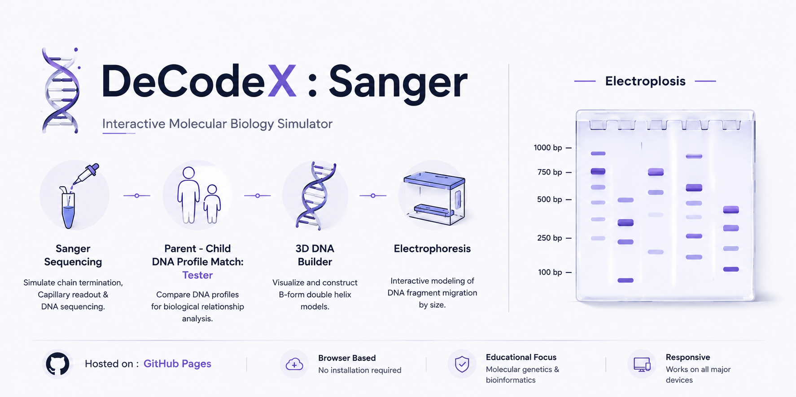

  

# 🧬 DeCodeX : Sanger

Interactive molecular biology simulator for DNA sequencing, genetic analysis, and electrophoresis.

---

## ✨ Features

* **Sanger Sequencing:** Visualize chain termination, capillary electrophoresis, and DNA readout.
* **Parent–Child DNA Analysis:** Compare DNA profiles through interactive sequence matching.
* **3D DNA Builder:** Explore and construct the B-form DNA double helix.
* **Gel Electrophoresis:** Simulate DNA fragment separation based on molecular size.

---

## 🚀 Built With & Hosted On

* **Repository:** GitHub
* **Hosting:** Vercel

---

## 🛠️ Credits & Acknowledgments

* **Claude Sonnet:** Debugging, code generation & architecture.
* **Replit:** Code improvisation & rapid prototyping.
* **OpenAI:** Scientific debugging, testing & logic optimization.

---

## 👤 Author

* **Draven Ashcroft**
  * M.Sc. Ag. Entomology, ASRB NET
  * DIPS Chain of Institutions

---

## 📜 License

GPL-3.0
